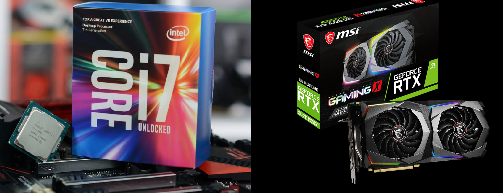
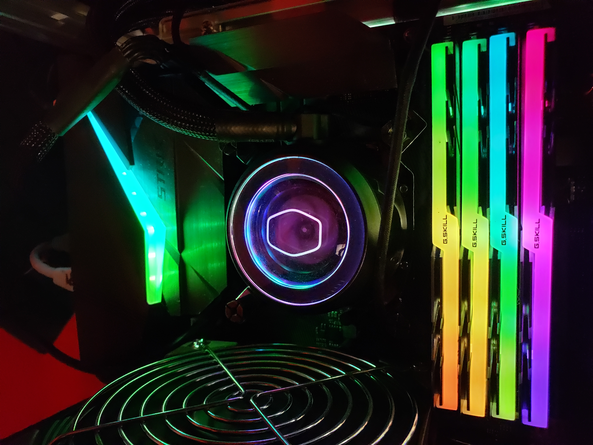
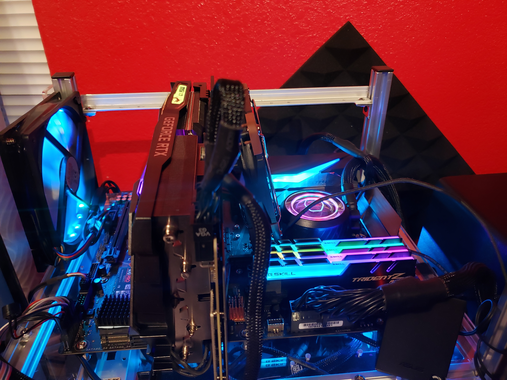
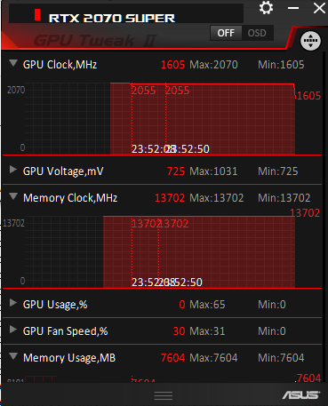
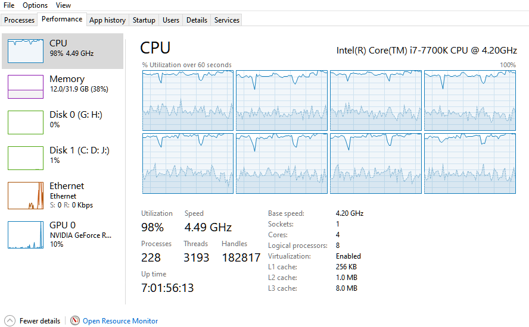

# TensorFlow-C/GPU-Benchmark
## Background
Out of my curiosity for hardware speed in the world of Machine Learning (ML), I want to validate the statement that many ML / AI Engineers made all over the internet: Traning models on GPU could be 5-10+ times faster than on CPU (pending on CPU/ GPU models). 

So in this mini-project, I set up a simple Jupyter Notebook with two kernels (run on two different venv, one utilizes only cpu, and the other utilizes only GPU). TensorFlow training time by utilizing CPU vs. GPU is then clocked and printed out for comparison.

<br>




## Observation
* Model trained time (in minutes):

Iteration | CPU | GPU | Difference (times)
----- | ------ | ------ | -------
1 |  | 1.193 |   
2 |  | 1.158 |   
3 |  | 1.252 |   


* The difference is :: GPU computed average 8.4 times faster than CPU
* Note: ***.Adam()*** optimization was used in both cases


## Benefit of Deep Learning by GPU
CPU is the brain of our computing devices, no matter if it is a high-end server, a desktop, or a laptop, or just a simple tablet. Utilizing GPU for ML brought benefits including: 
* Faster model training
* Freeing up CPU resources for other tasks/ processes that GPU can't be utilized

## Differences between GPU and CPU:
* CPU has fewer cores (4 x 2 with i7-7700K) which run processes sequentially, a few threads at a time
* GPU has more cores (40 x 64 with RTX 2070 SUPER) which allow parallel computing with thousands of threads at a time
* In deep learning, the host code runs on CPU where as CUDA code runs on GPU
* GPU is bandwidth optimized (carry multiple large size packages, in trade-off for speed)
* CPU is latency (i.e. memory/RAM access time, high speed but fewer and smaller packages) optimized
* Bandwidth of GPU is significantly larger than that of CPU, thanks to the VRAM
* The GPU capability of *Thread Parallelism* in GPU surpasses the latency

CPU | GPU
----- | ------
Several cores   | Many cores (a lot more)
Low latency | High throughput
Good for serial processing | Good for parallel processing
Can do a handful of operations at once | Can do thousands of operations at once

## Data Set-up:
* Utilizing MNIST Dataset: http://yann.lecun.com/exdb/mnist/
    * 60,000 digit images
* Keras instruction: https://keras.io/api/datasets/mnist/
* 30 Epochs were run for comparison

## Hardware:

 CPU Intel i7-7700K |  GPU NVIDIA RTX 2070 SUPER
---------|---------
   |  

<br>

View 1  |  View 2 
---------|---------
  |  


* Intel(R) Core(TM) i7-7700K CPU @ 4.20GHz
	* Base speed:	4.20 GHz
	* Full speed:	4.49 GHz (on-load Turbo Boost)
	* Sockets:	1
	* Cores:	4
    * Bus rate	4 × 8 GT/s
	* Logical processors:	8
	* Virtualization:	Enabled
	* L1 cache:	256 KB
	* L2 cache:	1.0 MB
	* L3 cache:	8.0 MB
    * Full Specs: <a href="https://ark.intel.com/content/www/us/en/dark/products/97129/intel-core-i7-7700k-processor-8m-cache-up-to-4-50-ghz.html">Intel Website</a>

* MSI NVIDIA GeForce RTX 2070 SUPER GAMING X
    * BIOS Version: 90.04.86.00.62
    * Stream Processors:	2560 CUDA Cores
    * Interface:	PCI Express 3.0 x16
    * Supported APIs:	DirectX: 12 | OpenGL: 4.5
    * Memory Speed:	14 Gb/s
    * Memory Configuration:	8 GB
    * Memory Interface:	GDDR6
    * Memory Interface Width:	256-Bit
    * Memory Bandwidth:	448 GB/s
    * Full Specs: <a href="https://www.msi.com/Graphics-card/GeForce-RTX-2070-GAMING-X-8G/Specification">MSI Website</a>

## Steps  
* First thing first, make sure you have <a href="https://www.anaconda.com/products/individual">Anaconda</a> or <a href="https://docs.conda.io/en/latest/miniconda.html">Miniconda</a> installed

### For using GPU:
* Documentations: <a href="https://docs.anaconda.com/anaconda/user-guide/tasks/tensorflow/"> Anaconda Website</a> 
* Follow these steps:
```
conda create -n <any_name_you_want_NO_space> tensorflow-gpu
conda activate <name_you_put_above>
conda install jupyter
python -m ipykernel install --user --name=<any_name_you_want_NO_space>
```  
* To check if GPU is ready for usage, run the file ```CUDA.py```, you should see all information about your GPU
* Deactivate this venv to install CPU venv: ```conda deactivate```   

NOTE: the kernel named above will be the kernel to use GPU for computing

### For using CPU:
```
conda create -n <any_name_you_want_NO_space> tensorflow
conda activate <name_you_put_above>
conda install jupyter
python -m ipykernel install --user --name=<any_name_you_want_NO_space>
jupyter notebook
```  

NOTE: the kernel you named above will be the kernel to use GPU for computing
* If you've done everything correctly, when Jupyter Notebook is run, you will see both of these kernels are available to use

### Run the tests
* Select one of the kernel that you want to run first, CPU or GPU doesn't matter
* Run the Jupyter Notebook on one kernel
* You will see the error on the ```break-here``` code. I purposedly leave it there so you can switch kernel and still keep the results of the previous kernel (if you want)
* At this point, it's up to you if you want to keep the output of the previous run or not
	* If you do: select the other kernel, re-run line by line until before you reach the function ```train_model(30)```. Skip this line, and go past ```break-here```, and run the ```train_model(30)``` below it
	* If you don't, simply hit run all, and the previous results will be overwritten
	
## Operations Pictures
 GPU | CPU
---- | ----
 | 
